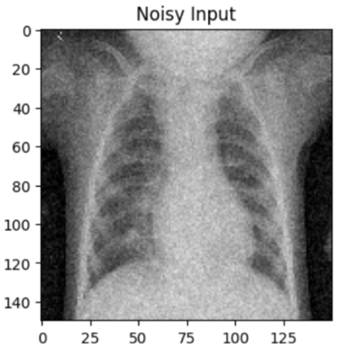
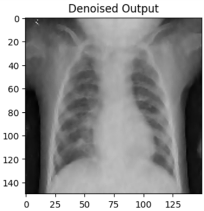
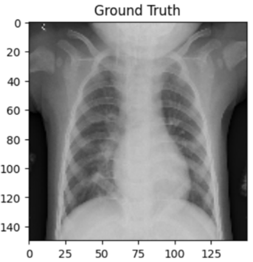

# AI-Assisted Medical Image Reconstruction and Denoising

This project focuses on using deep learning techniques to enhance and reconstruct low-dose medical images such as PET and MRI scans. The model architecture is based on U-Net, with potential for future extensions to diffusion models or physics-informed networks.

## ✨ Features

- Denoising of simulated low-dose PET/MRI images
- U-Net-based model with optional skip connections or attention modules
- Evaluation using PSNR, SSIM, and visual metrics
- Easily extendable for reconstruction or segmentation tasks

## 🖼️ Sample Result

| Low Dose Input | Reconstructed Output | Ground Truth |
|----------------|----------------------|--------------|
|  |  |  |

## 📁 Dataset

This project uses publicly available chest X-ray images from the following source:

- **Guangzhou Women and Children’s Medical Center Chest X-Ray Dataset**
- Available at: [Mendeley Data Repository](https://data.mendeley.com/datasets/rscbjbr9sj/2)
- Citation: [Cell Journal](http://www.cell.com/cell/fulltext/S0092-8674(18)30154-5)

This dataset is licensed under **CC BY 4.0**


## 🚀 Getting Started

```bash
# Clone the repo
git clone https://github.com/LI-explorer/AI-Medical-Imaging.git
cd AI-Medical-Imaging-Recon

# Install dependencies
pip install -r requirements.txt

# Run training
python src/train.py --config configs/default.yaml

# Evaluate
python src/eval.py --model_path checkpoints/model.pth


