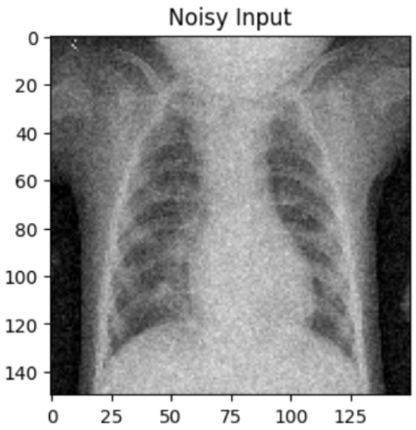

# AI-Assisted Medical Image Reconstruction and Denoising

This ongoing project focuses on applying deep learning techniques to medical imaging, aiming to enhance and reconstruct low-dose modalities such as PET and MRI scans. The current implementation is based on a U-Net architecture, with plans to extend the framework to include diffusion models and physics-informed networks.

A demo of the model pipeline and results is available in the `/notebooks` folder.

## ✨ Features

- Denoising of simulated low-dose PET/MRI images
- U-Net-based model with optional skip connections or attention modules
- Evaluation using PSNR, SSIM, and visual metrics (not showing in demo)
- Easily extendable for reconstruction or segmentation tasks

## 🖼️ Sample Result

| Low Dose Input | Reconstructed Output | Ground Truth |
|----------------|----------------|----------------|
|  |  |  |

## 📁 Dataset

This project uses publicly available chest X-ray images from the following source:

- **Guangzhou Women and Children’s Medical Center Chest X-Ray Dataset**
- Available at: [Mendeley Data Repository](https://data.mendeley.com/datasets/rscbjbr9sj/2)
- Citation: [Cell Journal](http://www.cell.com/cell/fulltext/S0092-8674(18)30154-5)

This dataset is licensed under **CC BY 4.0**


## 🚀 Getting Started

```bash
# Clone the repo
git clone https://github.com/LI-explorer/AI-Medical-Imaging.git
cd AI-Medical-Imaging-Recon

# Please download the dataset and save it in specific folder. 

# Install dependencies
pip install -r requirements.txt

# Run training
python src/train.py --config configs/default.yaml

# Evaluate
python src/eval.py --model_path checkpoints/model.pth


